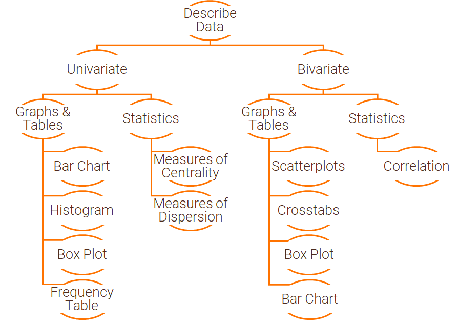

# Examining and Summarizing Data

## R Packages and Datasets for Topic 1

``` {r t1packagesdata, message=FALSE}
library(ggplot2)     # Advanced graphing capabilities
library(dplyr)       # Easier programming
library(tidyr)       # Easier programming   
library(sjPlot)      # Easily create cross-tabs
library(vtable)      # Easily create summary tables using 'sumtable'
library(flextable)
library(MKT4320BGSU)
data(airlinesat)
```

## Motivation

After data preparation, examining and summarizing the data provides the analyst with a “feel” for the data

* Distributions of variables
* Relationships between variables
* Missing observations
* Coding of variables

## Overview

How we examine and summarize data depends on:

* Type of data
    * Nominal
    * Ordinal
    * Continuous
    
* Number of variables
    * Univariate
    * Bivariate

```{r echo=FALSE, out.width='100%', cache=TRUE, warning=FALSE, message=FALSE}
knitr:: 
```


## Univariate - Graphs and Tables

### Bar Chart

* Primarily for nominal/ordinal data
* Displays each category's...
    * Frequency (usually)
    * Centrality
    * Dispersion

***Figure 1.1: Bar Chart***
``` {r t1barchart, cache=TRUE, warning=FALSE, message=FALSE}
airlinesat %>%     # Dataset
         # Group by variable 'status'
   group_by(status) %>%
         # Create variable 'n' equal to number of obs for each status
   summarize(n=n()) %>%
         # Create variable 'prop' equal to proportion for each status
   mutate(prop=n/sum(n)) %>%
         # Begin plot with 'status' on x, 'prop' on y
         # 'fill=status' gives different color bars for each 'status'
   ggplot(aes(x=status, y=prop, fill=status)) +
         # Request column chart as the geom function
   geom_col() +
         # Add data labels rounded to 1 digit with trailing zeros
         # Place labels in correct spot with 'white' color
   geom_text(aes(label=format(round(prop*100,1),1)),
             vjust=1.5, color="white") + 
         # Change text size to be larger; remove legend created by 'fill'
   theme(text=element_text(size=15),
         legend.position="none") +
         # Adds axis labels
   labs(x="Status",y="Proportion")
```


### Histogram

* Non-overlapping categories of equal width from continuous data
* Shows frequency in each category
* Used to examine distribution of variable

***Figure 1.2: Histogram 1***
``` {r t1histogram1, cache=TRUE, warning=FALSE, message=FALSE}
airlinesat %>%     # Dataset
         # Begin plot with 'age' on x axis
   ggplot(aes(x=age)) +
         # Request histogram as geom, binwidth of 2, y represents density
   geom_histogram(binwidth=2, aes(y=..density..), 
                     color="black", fill="tan") +
         # Creates normal curve overlay
   stat_function(fun=function(x) dnorm(x, mean=mean(airlinesat$age),
                                       sd=sd(airlinesat$age))) +
         # Changes text size to be larger
   theme(text=element_text(size=15)) +
         # Adds axis labels
   labs(x="Age", y="Density")
```


***Figure 1.3: Histogram 2***
``` {r t1histogram2, cache=TRUE, warning=FALSE, message=FALSE}
airlinesat %>%     # Dataset
         # Drop rows with missing values for variable 's1'
   drop_na(s1) %>%
         # Begin plot with 's1' on x axis
   ggplot(aes(x=s1)) +
         # Request histogram as geom, binwidth of 2, y represents density
         # Pick different colors than previous histogram
   geom_histogram(binwidth=2, aes(y=..density..), 
                     color="saddlebrown", fill="orange") +
         # Creates normal curve overlay
   stat_function(fun=function(x) dnorm(x, 
                                       mean=mean(airlinesat$s1, na.rm=TRUE),
                                       sd=sd(airlinesat$s1, na.rm=TRUE))) +
         # Changes text size to be larger
   theme(text=element_text(size=15)) +
         # Adds axis labels
   labs(x="Airline gets me there on time (Satisfaction)", y="Density")
```


### Box Plot

* Displays distribution of continuous data
    * Conveys dispersion information
    * Wider box = More dispersion
    * Can help identify potential outliers
* How to interpret:
    * Box in middle is the Interquartile Range
        * Q3 (75th percentile) - Q1 (25th percentile)
    * Line in middle is the median
    * Upper/lower lines are upper/lower adjacent values
        * Upper adjacent value is the largest observation that is smaller than
        Q3 + 1.5*IQR
        * Lower adjacent value is the smallest observation that is larger than
        Q1 - 1.5*IQR
    * Any observations above (below) the upper (lower) adjacent value are
    plotted separately, and *could* be outliers

***Figure 1.4: Box Plot***
``` {r t1boxplot, cache=TRUE, warning=FALSE, message=FALSE}
airlinesat %>%     # Dataset
         # Begin plot with no grouping x variable, age as continuous y variable 
   ggplot(aes(x="", y=age)) +
         # Request boxplot as the geom, add whiskers with 'staplewidth'
   geom_boxplot(staplewidth=1) +
         # Changes text size to be larger
   theme(text=element_text(size=15)) +
         # Adds axis labels
   labs(x="", y="Age")
```


### Frequency Table

* Displays counts and percentages for categorical variables
* Similar to bar chart, but in table form

***Table 1.1: Frequency Table***
``` {r t1freqtable, cache=TRUE, warning=FALSE, message=FALSE}
sumtable(airlinesat, "status", title=NA)  # Use package 'vtable::sumtable()'
```

## Univariate - Statistics

### Measures of Centrality

* Values of a “typical” or “average” score
* Mean is the sum of all observations divided by the number of observations
    * Only appropriate for continuous data
* Median separates highest and lowers 50% of observations
    * Cannot be used on categorical data
    
### Measures of Dispersion

* Provide info about variability in the data
* Range is the highest minus the lowest observation
    * Simple, but includes extreme values
    * Not appropriate for categorical data
* Interquartile Range (IQR) is Q3 (75th percentile) - Q1 (25th percentile)
    * Used in the Box Plot
    * Not appropriate for categorical data
* Standard Deviation
    * Given by Equation 1.1 below

    \begin{equation} 
    s = \sqrt{\frac{\sum_{i=1}^{n}{(x_i - \bar{x})^2}}{n-1}}
    (\#eq:stdev)
    \end{equation} 

    * Only appropriate with continuous data

***Table 1.2: Measures of Centrality and Dispersion***
``` {r t1statistics1, cache=TRUE, warning=FALSE, message=FALSE}
sumtable(airlinesat, c("age", "s1"),    # Data and variables
         add.median = TRUE, digits = 4) # Add median; request 4 digits
```


***Table 1.3: Measures of Centrality and Dispersion***
``` {r t1statistics2, cache=TRUE, warning=FALSE, message=FALSE}
# Using dplyr
airlinesat %>%    # Data
         # Select variables
   select(age) %>%
         # Summarise variables
   summarise(n = n(),
             mean = mean(age, na.rm = TRUE),
             sd = sd(age, na.rm = TRUE),
             median = median(age, na.rm = TRUE),
             iqr = IQR(age, na.rm = TRUE),
             min = min(age, na.rm = TRUE),
             max = max(age, na.rm = TRUE)) %>%
         # Pass to flextable for nicer output
   flextable()
```


## Bivariate - Graphs and Tables

### Scatterplots

* Graphically shows how two continuous variables are related
    * If dots appear in to follow a line, variables are likely related (see Figure 1.5)
    * If dots appear random, variables are likely not related (see Figure 1.6)
    * Not appropriate for categorical data (see Figure 1.7)


***Figure 1.5: Scatterplot 1 with Fitted Line***
``` {r t1scatterplot1, cache=TRUE, warning=FALSE, message=FALSE}
airlinesat %>%     # Data
         # Begin plot with x (s18) and y (s17) variables
   ggplot(aes(x=s18, y=s17)) +
         # Request scatter plot as geom
   geom_point() +
         # Request linear regression fitted line without confidence interval
   geom_smooth(method="lm", se=FALSE) +
         # Change text size to be larger
   theme(text=element_text(size=15)) +
         # Add axis labels
   labs(x="Employees are service-oriented (s18)",
        y="Employees are friendly (s17)")
```


***Figure 1.6: Scatterplot 2 without Fitted Line***
``` {r t1scatterplot2, cache=TRUE, warning=FALSE, message=FALSE}
airlinesat %>%     # Data
         # Begin plot with x (age) and y (s11) variables
   ggplot(aes(x=age, y=s11)) +
         # Request scatter plot
   geom_point() +
         # Changes text size to be larger
   theme(text=element_text(size=15)) +
         # Adds axis labels
   labs(x="Age",
        y="Aircraft interior is well maintained (s11)")
```


***Figure 1.7: Scatterplot of Categorical Data***
``` {r t1scatterplot3, cache=TRUE, warning=FALSE, message=FALSE}
airlinesat %>%     # Data
      # Begin plot with x (age) and y (s11) variables
   ggplot(aes(x=flight_type, y=flight_purpose)) +
         # Requests scatter plot
   geom_point() +
         # Changes text size to be larger
   theme(text=element_text(size=15)) +
         # Adds axis labels
   labs(x="Flight Type",
        y="Flight Purpose")
```


### Crosstabs

* Show if and how two categorical variables are related
    * Common to put “DV” in rows and “IV” in columns
    * Can ask for $\chi^2$ to test if for significant association
    * Can also view it visually with a stacked bar chart (see Figure 1.8)
        * Percentages represent column percentages
    * Can also view it visually with separate bars for each category (see Figure 1.9)
        * Bar height is percent of total

***Table 1.4: Crosstab***
``` {r t1crosstab1, cache=TRUE, warning=FALSE, message=FALSE}
# Use package sjPlot to easily create cross-tab
tab_xtab(var.row=airlinesat$flight_purpose, # Set row variable
         var.col=airlinesat$flight_type, # Set column variable
         show.col.prc=TRUE) # Request column percentages
```


***Figure 1.8: Stacked Bar Chart***
``` {r t1stackedbarchart, cache=TRUE, warning=FALSE, message=FALSE}
airlinesat %>%     # Data
         # Group data by crosstab variables (column then row)
   group_by(flight_type, flight_purpose) %>%
         # Create variable 'n' for count of observations in each cell
   summarise(n=n()) %>%
         # Create column percentages
   mutate(prop=100*n/sum(n)) %>%
         # Begin plot: 'type' (x), 'prop' (y), 'purpose' (fill color)
   ggplot(aes(x=flight_type, y=prop, fill=flight_purpose)) +
         # Request column chart as geom
   geom_col() +
         # Adds data labels to middle of bars
   geom_text(aes(label=format(round(prop,1),1)), 
             position=position_stack(vjust=0.5), color="white") +
         # Changes test size to be larger
   theme(text=element_text(size=15)) +
         # Adds axis and legend labels
   labs(x="Flight Type", y="Percent", fill="Flight Purpose")
```


***Figure 1.9: Side-by-Side Bar Chart***
``` {r t1sidebysidebarchart, cache=TRUE, warning=FALSE, message=FALSE}
airlinesat %>%     # Data
         # Group data by crosstab variables (column, row)
   group_by(flight_type, flight_purpose) %>%
         # Create variable 'n' for count of observations in each cell
         # Drop grouping structure to get total percentages
   summarise(n=n(), .groups="drop") %>%
         # Create total percentages
   mutate(prop=100*n/sum(n)) %>%
         # Begin plot: 'type' (x), 'prop' (y), 'purpose' (fill color)
   ggplot(aes(x=flight_type, y=prop, fill=flight_purpose)) +
         # Request column chart as geom
         # Position bars side-by-side instead of stacked
   geom_col(position = position_dodge(width=.9)) +
         # Add data labels to end of bars
   geom_text(aes(label=format(round(prop,1),1)), vjust=1.5, 
             position=position_dodge(width=.9), color="white") +
         # Changes test size to be larger
   theme(text=element_text(size=15)) +
         # Adds axis and legend labels
   labs(x="Flight Type", y="Percent", fill="Flight Purpose")
```


### Box Plot

* Displays distribution of continuous data across classes of a categorical variable


***Figure 1.10: Box Plot by Category***
``` {r t1boxplot2chart, cache=TRUE, warning=FALSE, message=FALSE}
airlinesat %>%     # Data
         # Begin plot with 'status' as grouping and 'age' as continuous variable 
   ggplot(aes(x=status, y=age)) +
         # Request boxplot as the geom function with whiskers ('staplewidth')
   geom_boxplot(staplewidth=1) +
         # Changes text size to be larger
   theme(text=element_text(size=15)) +
         # Adds axis labels
   labs(x="Status", y="Age")
```


### Bar Chart

* Displays mean (or some other value) of continuous data across classes of a categorical variable


***Figure 1.11: Bar Chart by Category***
``` {r t1barchart2chart, cache=TRUE, warning=FALSE, message=FALSE}
airlinesat %>%     # Data
         # Group data by 'status'
   group_by(status) %>%
         # Create variable 'mean' for mean of 'age' by 'status'
   summarise(mean=mean(age)) %>%
         # Begin plot with 'status' on x, 'mean' on y
   ggplot(aes(x=status, y=mean)) +
         # Requests column chart as geom
         # Position bars side-by-side instead of stacked
         # Set fill color to match status
   geom_col(position=position_dodge(width=.9),
            fill=c("midnightblue","gold","gray")) +
         # Sets number of breaks on y-axis
   scale_y_continuous(n.breaks=6) +
         # Adds data labels to outside end of bars
   geom_text(aes(label=format(round(mean,2),2)), vjust=-.5, 
             position=position_dodge(width=.9), color="black") +
         # Changes test size to be larger
   theme(text=element_text(size=15)) +
         # Adds axis and legend labels
   labs(x="Status", y="Mean of Age")
```


## Statistics

### Correlation

* Provides a measure of linear association between two continuous variables
    * Given by Equation 1.2 below

    \begin{equation} 
    r = \frac{\sum_{i=1}^{n}{(x_i - \bar{x})(y_i-\bar{y})}}{(n-1)s_xs_y}
    (\#eq:pearcorr)
    \end{equation}
    
    * $-1 \le r \le 1$


***Table 1.5: Correlation Matrix***
``` {r t1correlation1, cache=TRUE, warning=FALSE, message=FALSE}
# Create dataframe of variables to include
corrvars <-  airlinesat %>% 
   select(age, nflights, e7, s11)

# Use package sjPlot to easily create correlation matrix

tab_corr(corrvars,
         na.deletion = "pairwise",  # Delete obs if either variable is missing
         corr.method = "pearson",  # Choose Pearson correlation coefficient
         show.p = TRUE,  # Show asterisks for significant correlations
         digits = 3,  # Show three decimal points
         triangle = "lower",  # Show only lower triangle
         fade.ns=FALSE)  # Do not fade insignficant correlations
```


## Suggested Readings

* *R for Marketing Research and Analytics. 2nd Edition* (2019). Chapman, Chris; McDonnel Feit, Elea
    * BGSU Library Link:<br><a href="https://librarysearch.bgsu.edu/permalink/01OHIOLINK_BGSU/i5ro6c/alma9926179903408506" target="_blank" rel="noopener noreferrer">https://librarysearch.bgsu.edu/permalink/01OHIOLINK_BGSU/i5ro6c/alma9926179903408506</a>
    * Chapter 3: Describing Data
    * Chapter 4: Relationships Between Continuous Variables
    * Chapter 5: Tables and Visualization
* *OpenIntro Statistics. 4th Edition* (2019). Diez, David; Cetinkaya-Rundel, Mine; Barr, Christopher D.
    * Available at OpenIntro.org:<br><a href="https://www.openintro.org/book/os/" target="_blank" rel="noopener noreferrer">https://www.openintro.org/book/os/</a>
    * Summarizing Data
    
* *Multivariate Data Analysis*. Hair, Joseph F.; Black, William C.; Babin, Barry J.; Anderson, Rolph E.
    * 7th Edition: Search for “multivariate data analysis 7th edition hair”
        * Graphical Examination of the Data (pp. 34-40)
    * 5th Edition: Course reserves
        * Graphical Examination of the Data (pp. 40-46)
