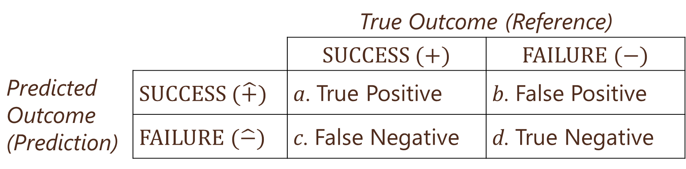
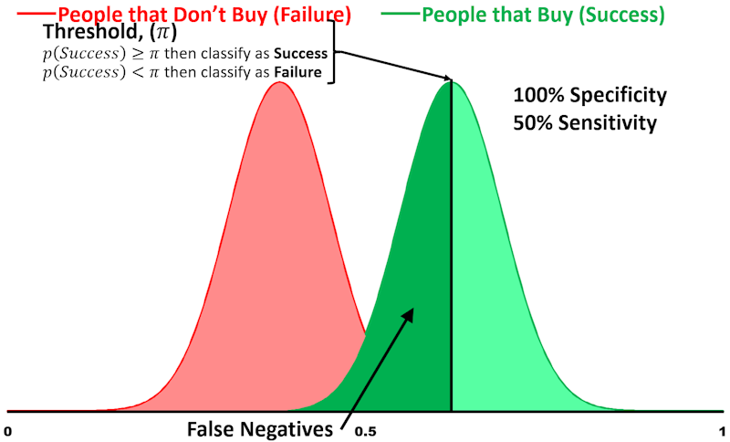
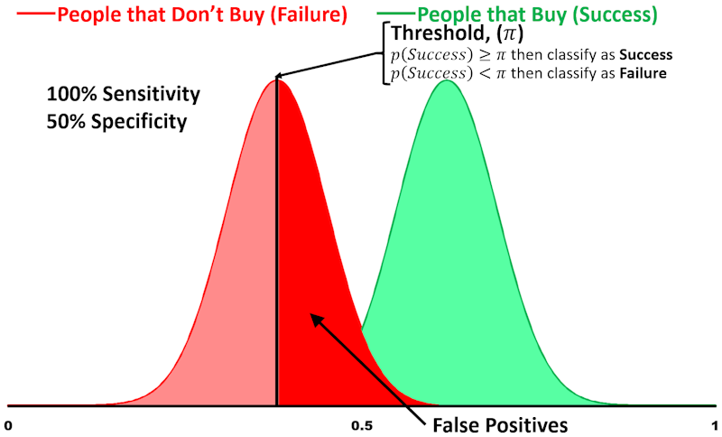

# Logistic Regression

## R Packages and Datasets for Topic 3

``` {r t3packagesdata, message=FALSE}
library(ggplot2)       # Advanced graphing capabilities
library(cowplot)       # Plots in grid
library(tidyr)         # Easier programming   
library(flextable)     # Better looking tables
library(jtools)        # Concise regression results
library(dplyr)         # Easier programming
library(MKT4320BGSU)
data(directmktg)
```


## Motivation

* Marketers often observe binary outcomes
    * Did a customer:
        * purchase?
        * subscribe?
        * renew?
        * respond?
* Using linear regression is not appropriate…
* …But logistic regression still allows us to:
    * Understand IV/DV relationships
    * Make predictions


## Why not use linear regression?

Want to see how $age$ affects $buy$

* $buy=\begin{cases}1\text{ if yes/true}\\0\text{ if no/false}\end{cases}$

Examine relationship with a scatterplot

* What do we see?

***Figure 3.1: Scatterplot with Binary DV***
```{r t3scatter01, cache=TRUE, warning=FALSE, message=FALSE}
directmktg %>%    # Data
         # Create numeric 0,1 variable for factor variable "buy"
   mutate(buy01=as.numeric(buy)-1) %>%
         # Send to ggplot
   ggplot(aes(x=age, y=buy01)) +
   geom_point(size=3, color="red") +
   theme(text=element_text(size=15)) +
            labs(x="Age", y="Buy")
```


* Try linear regression: $buy=\alpha+\beta_1 age$  


***Table 3.1: Linear Regression Results***
```{r t3linreg01, cache=TRUE, warning=FALSE, message=FALSE}
model <- directmktg %>%
   mutate(buy=as.numeric(buy)-1) %>%
   lm(buy ~ age, .)
summ(model, model.info=FALSE, digits=4)
```

* Good $R^2$ and $age$ is highly significant
* So what's the problem?

* Predict $buy$ from linear regression results:<br>
$\hat{buy}=-.7154+.0285age$

* Prediction line shown in plot

***Figure 3.2: Predicted Values from Linear Regression***
```{r t3scatter02, cache=TRUE, warning=FALSE, message=FALSE}
directmktg %>%
   select(age) %>%
   mutate(yhat=predict(model,.)) %>%
   mutate(neg=as.factor(ifelse(yhat<0,"Yes","No"))) %>%
   ggplot(aes(x=age, y=yhat, color=neg)) +
   geom_point(size=3) +
   scale_color_manual(values=c("Yes"="red",
                               "No"="black"),
                               guide="none") +
   theme(text=element_text(size=15)) +
   labs(x="Age", y="Linear Prediction")
```


Add $age$ categories and plot mean $buy$ for each category
    * What "shape" does this resemble?
    * Can we use this "shape" to model the relationship?


***Figure 3.3: Buy for Age Groups***
```{r t3lineshape, cache=TRUE, warning=FALSE, message=FALSE}
# Create data frame grouped by age
dmgrp <- directmktg %>%
         # 'cut' breaks a continuous variable into groups of each width
         # 'as.numeric' keeps the new variable as integer (vs. factor)
   mutate(agegrp = as.numeric(cut(age, 9))) %>%
   group_by(agegrp) %>%
   summarise(age=mean(age), buy=mean(as.numeric(buy)-1))

      # Run logistic model to create prediction to make s-curve
binmod <- glm(buy~age, directmktg, family="binomial")

      # Create dataframe with predicted values
dmpred <- directmktg %>%
   select(age, buy) %>%
   mutate(yhat=predict(binmod, type="response"),
          buy=as.numeric(buy)-1)
    

      # Create combined plot; each geom with separate data
ggplot() + 
   geom_point(data=directmktg, 
              aes(x=age, y=(as.numeric(buy)-1)), 
              size=3, color="red") + 
   geom_line(data=dmgrp, 
             aes(x=age, y=buy), 
             size=1.5, color="midnightblue") +
        geom_line(data=dmpred, 
                  aes(x=age, y=yhat), 
                  size=1.5, color="darkorange") +
   theme(text=element_text(size=15)) + 
   labs(x="Age", y="Buy")
```

## Understanding Logistic Regression

* Uses the logistic function:<br>
$f(z)=\frac{e^u}{1+e^u}$  
    * $f(z)$ is the probability of event happening
        * When $u=0$, $f(z)=\frac{e^0}{1+e^0}=\frac{1}{1+1}=0.5$
    * $u$ is a linear function, such as: $\alpha+\beta x$
* Ensures predictions are never above 1 or below 0

***Figure 3.4: Logistic Function***
```{r t3logitcurve, cache=TRUE, warning=FALSE, message=FALSE}
   # Create simulated data frame based on logistic function
u=seq(-7,7,.05)
fz=exp(u)/(1+exp(u))
ufz=data.frame(u=u, fz=fz)
   # Plot function
ufz %>%
   ggplot(aes(x=u, y=fz)) +
   geom_line(color="darkorange", size=1.5) +
   theme(text=element_text(size=15),
         panel.grid.major.x = element_blank()) +
   scale_x_continuous(breaks=0, minor_breaks=NULL) +
   scale_y_continuous(breaks=seq(0,1,1), minor_breaks=NULL) +
   labs(x="u", y="f(z)") +
   annotate("segment", x=0, y=0, xend=0, yend=0.5, 
                linewidth = 1, color="red") +
   annotate("segment", x=-7, y=0.5, xend=0, yend=0.5, 
                linewidth = 1, color="red") 
```

* Probability of event success vs. failure $=\frac{f(z)}{1-f(z)}=$ Odds Ratio ($OR$)
    * Suppose probability of success $=.01$, then:<br>
    $OR=\frac{.01}{1-.01}=.0101$
        * Suppose probability of success $=.001$, then:<br>
    $OR=\frac{.001}{1-.001}=.0010$
        * Suppose probability of success $=.99$, then:<br>
    $OR=\frac{.99}{1-.99}=99$
        * Suppose probability of success $=.999$, then:<br>
    $OR=\frac{.999}{1-.999}=999$
        * Suppose probability of success $=.5$, then:<br>
    $OR=\frac{.5}{1-.5}=1$
* Substituting logistic function for $f(z)$ into Odds Ratio $\Rightarrow$<br>
$OR=e^u=e^{\alpha+betax}$
    * $\frac{f(z)}{1-f(z)}=\frac{\frac{e^u}{1+e^u}}{1-\frac{e^u}{1+e^u}}=\frac{\frac{e^u}{1+e^u}}{\frac{1+e^u}{1+e^u}-\frac{e^u}{1+e^u}}=\frac{\frac{e^u}{1+e^u}}{\frac{1}{1+e^u}}=e^u$
* Can transform exponential function into linear $\Rightarrow$<br>
$Logit=\ln(OR)=\alpha+\beta x$

## Conducting Logistic Regression

* Model Estimation
* Assessing Model Fit
    * Goodness of Fit Measures
    * Classification Matrix
    * ROC Curve
* Interpreting Coefficients
* Gains and Lift

### Model Estimation

* Best to use training data and holdout data  
    * Estimate model on training data (~75% of sample)
    * Check prediction accuracy on holdout data (~25%)
* Can estimate either (1) $OR$ or (2) $Logit$ formulation
    (1) $OR=e^{\alpha+\beta_1x_1+\cdots+\beta_kx_k}$
    (2) $Logit=\alpha+\beta_1x_1+\cdots+\beta_kx_k$
* Independent variables:
    * Can be one or more
    * Can be continuous or categorical/factor

### Assessing Model Fit

#### Goodness-of-Fit Measures

* Overall significance based on $-2LL$
    * Lower (closer to $0$) $-2LL$ indicates a better fit
    * Compare $-2LL$ of estimated model with "null" model
* McFadden's Pseudo-$R^2$
    * Values range from 0 to 1 like linear regression
    * Interpreted in a similar manner
        * Amount of variation in DV explained by IVs

#### Classification Matrix

* How does the model do in predicting outcomes?
* Generate predicted probability of success, $p(\text{SUCCESS})$, for each observation
    * If $p(\text{SUCCESS})\ge0.5$, predict $\text{SUCCESS}=1$
    * If $p(\text{SUCCESS})<0.5$, predict $\text{SUCCESS}=0$, or $\text{FAILURE}$
* Check predictions against actual outcomes
    * Examine both training and holdout data


***Figure 3.5: Classification Matrix***
```{r t3classmatimg, echo=FALSE}

```

* Four main measures
    * Sensitivity: Predicted success given actual success
        * $p(\hat{+}|+)=a/(a+c)$
        * *"Of all the people who actually had the outcome, how many did we predict correctly?"*
    * Specificity: Predicted failure given actual failure
        * $p(\hat{-}|-)=d/(b+d)$
        * *"Of all the people who didn't actually have the outcome, how many did we predict correctly?"*
    * Precision: Proportion of positive predictions actually correct
        * $a/(a+b)$
        * *"Of all the times predicted the outcome, how many were correct?*
    * Overall correctly classified
        * $(a+d)/(a+b+c+d)$
* Sensitivity vs. Specificity
    * Ideally, want both to be high, but...<br>
    the $p(\text{SUCCESS})\ge\pi$ threshold can be changed
    * Why change $\pi$? Avoid false positives or negatives
    * By default:
        * Increasing sensitivity decreases specificity
        * Increasing specificity decreases sensitivity
        * Visualizing sensitivity and specificity
            ```{r t3vizsensspec01, echo=FALSE, out.width="70%"}
            knitr::include_graphics("Topic03/SensSpec1.png")
            ```
            ```{r t3vizsensspec02, echo=FALSE, out.width="70%"}
            knitr::include_graphics("Topic03/SensSpec2.png")
            ```
            ```{r t3vizsensspec03, echo=FALSE, out.width="70%"}
            
            ```
            ```{r t3vizsensspec04, echo=FALSE, out.width="70%"}
            
            ```
* Overall correctly classified
    * Compare with *Proportional Chance Criterion (*$PCC$*)*
        * $PCC$ is the "average" probability of classification based on group sizes
    * $PCC=p^2+(1-p)^2$ where $p$ is the proportion of sample in the $\text{SUCCESS}$ group
    * Overall correctly classified $>PCC$ considered good fit when examining holdout data
    
    
#### ROC Curve

* Plot sensitivity by $1-$ specificity as $\pi$ goes from $0$ to $1$
* More area under curve means better model
<table style="text-align: center;"><tr><td><strong>Area under Curve</strong></td><td><strong>Discrimination</strong></td></tr>
<tr><td style="font-family: cambria;"><em>AUC</em> = .5</td><td>None</td></tr>
<tr><td style="font-family: cambria;">.5 < <em>AUC</em> < .7</td><td>Poor</td></tr>
<tr><td style="font-family: cambria;">.7 &le; <em>AUC</em> < .8</td><td>Acceptable</td></tr>
<tr><td style="font-family: cambria;">.8 &le; <em>AUC</em> < .9</td><td>Excellent</td></tr>
<tr><td style="font-family: cambria;"><em>AUC</em> &ge; .9</td><td>Outstanding</td></tr>
</table>

***Figure 3.6: Sample ROC Curve***
```{r t3sampleroc, cache=TRUE, warning=FALSE, message=FALSE}
spec <- seq(0,1,.001)
sens <- sqrt(1-spec^2)
df <- data.frame(spec,sens)
data.frame(spec,sens) %>% 
   mutate(sens=ifelse(sens>1,1,sens)) %>%
   mutate(sens=ifelse(sens<0,0,sens)) %>%
   ggplot(aes(x=spec, y=sens)) +
   geom_line(color="darkorange", size=2) +
   scale_x_reverse() + 
   geom_segment(x=-1, y=0, xend=0, yend=1, 
                color="forestgreen", size=2) + 
   geom_segment(x=-.495, y=.495, xend=-.375, yend=.375,
                arrow=arrow(ends="first")) +
   annotate("text", x=.375, y=.35, 
            label="Chance Model", size=6) +
   theme(text=element_text(size=15)) +
   labs(x="Specificity", y="Sensitivity")
```
 
### Interpreting Coefficients

* Relationship between DV and each IV
* $H_0: \beta_k=0$ *vs.* $H_a: \beta_k\ne0$
* Interpret significant relationships
    * Interpretation depends on $OR$ or $Logit$ estimation
    * Direction of relationship:
        * $Logit$ estimation: $\beta_k>0$ for positive, $\beta_k<0$ for negative
        * $OR$ estimation: $\beta_k>1$ for positive, $\beta_k<1$ for negative
    * Magnitude of change:
        * $Logit$ estimation: coefficients are not particularly useful
        * $OR$ estimation:
            * Percentage change in odds
            * Compare probabilities between groups
* Interaction of continuous IV and dummy IV
    * $Logit=\alpha+\beta_1x_1+\beta_2D+\beta_3(x_1\times D)$
    * When $D=0$, $Logit=\alpha+\beta_1x_1$, so:<br>$OR(x_1)=e^{\beta_1}$
    * When $D=1$, $Logit=(\alpha+\beta_2)+(\beta_1+\beta_3)x_1$, so:<br>$OR(x_1)=e^{(\beta_1+\beta_3)}$
            
### Gain and Lift

* Evaluate performance of classification
* Example:
    * Suppose $10\%$ of $2000$ customers will accept offer
    * For $100$ random customers, expect $10$ accepted offers
    * Model predicts some customers more likely to accept
    * Instead of contacting $100$ random customers…<br>Contact $100$ most likely to accept based on model
    * Continue doing this in groups of $100$ (or $200$, etc.)
* Gain and lift provide measures of how much better the model performs vs. no model/random
* Process
    1) Predict $p(\text{SUCCESS})$ for each observation and sort descending
    2) Split into 10 (deciles) or 20 (demi-deciles) ordered groups
    3) Calculate $\%$ observations and $\%$ successes for each group

#### Gain

* Cumulative successes up to that group divided by total successes across all groups
* Plot on $y$-axis, with cumulative percent of observations on $x$-axis
* Example:
    * Supposed out of 2000 customers, 200 (or 10%) will ultimately buy
    * If we randomly contact 20% (or 400), how many buyers would be expect?
        * 20% of 200 total buyers = 40 buyers
    * What if we contact the top 20% most likely to buy?
        * Get about 55% of ultimate buyers...
        * 55% of 200 total buyers = 110 buyers
    * We "gained" 35% or 70 buyers

***Figure 3.7: Typical Gain Chart Shape***
```{r t3typgain, cache=TRUE, warning=FALSE, message=FALSE}
pcc <- seq(.05,1,.01)
pcp <- .3376*log(pcc)+1.0944

data.frame(pcc,pcp) %>%
   mutate(pcp=ifelse(pcp>1,1,pcp)) %>%
   ggplot(aes(x=pcc, y=pcp)) +
   geom_line(color="midnightblue", size=1) + 
   scale_x_continuous("Proportion Customers Contacted",
                      limits=c(.05,1), breaks=seq(.1,1,.1)) +
   scale_y_continuous("Proportion Customers Positive",
                      limits=c(.05,1), breaks=seq(.1,1,.1)) +
   geom_segment(x=.05, y=.05, xend=1, yend=1, 
                color="red", size=1) +
   geom_segment(x=.9, y=.775, xend=.9, yend=.895,
                arrow=arrow(ends="last")) +
   annotate("text", x=.9, y=.765, 
            label="Baseline Model", size=5) +
   theme(text=element_text(size=15)) +
   geom_segment(x=.2, y=0, xend=.2, yend=.55105376, 
                linetype=2, color="darkorange", size=.75) +
            geom_segment(x=0, y=.2, xend=.2, yend=.2, 
                         linetype=2, color="darkorange", size=.75) +
            geom_segment(x=0, y=.55105376, xend=.2, yend=.55105376,
                         linetype=2, color="darkorange", size=.75)
```

#### Lift

* Ratio of cumulative success up to that group divided by expected success from no model
* Plot on $y$-axis, with cumulative percent of observations on $x$-axis

***Figure 3.8: Typical Lift Chart Shape***
```{r t3typlift, cache=TRUE, warning=FALSE, message=FALSE}
lift <- 2.7863*pcc^3-4.5901*pcc^2+.2319*pcc+2.5673
data.frame(pcc,lift) %>%
   mutate(lift=ifelse(lift<1,1,lift)) %>%
   ggplot(aes(x=pcc, y=lift)) +
   geom_line(color="midnightblue", size=1) + 
   scale_x_continuous("Proportion Customers Contacted",
                      limits=c(.05,1), breaks=seq(.1,1,.1)) +
   scale_y_continuous("Lift",
                      limits=c(1,2.6), breaks=seq(1,2.5,.25)) +
   geom_segment(x=.05, y=1, xend=1, yend=1, color="red", size=1) +
   geom_segment(x=.5, y=1, xend=.5, yend=1.25,
                arrow=arrow(ends="first")) +      
   annotate("text", x=.5, y=1.3, label="Baseline Model", size=5) +
   theme(text=element_text(size=15)) +   
   geom_segment(x=.2, y=1, xend=.2, yend=2.452366, 
                linetype=2, color="darkorange", size=.75) +
   geom_segment(x=0, y=2.452366, xend=.2, yend=2.452366, 
                linetype=2, color="darkorange", size=.75)
```

### Sensitivity/Specificity Plots

* Sensitivity, Specificity, and Accuracy depend on the cutoff value for predicting SUCCESS/ FAILURE
    * While 0.5 is the most common threshold, it might not be the best threshold for prediction
    * Looking for:
        * High accuracy
        * Relative balance between specificity and sensitivity
* Sensitivity/Specificity Plots can show the analyst how each changes with different cutoff values
    
***Figure 3.9: Sample Sensitivity/Specificity Plot***
``` {r t3sensspecplot, cache=TRUE, warning=FALSE, message=FALSE}
pcc <- seq(0,1,.01)
sens <- 1.0189-.01678*pcc-.8349*pcc^2
spec <- 1.9211*pcc-.8349*pcc^2-.0778
acc <- .45+1.6*pcc-1.6*pcc^2
data.frame(pcc, sens, spec, acc) %>%
   mutate(sens=ifelse(sens>1,1,sens)) %>%
   mutate(spec=ifelse(spec<0,0,spec)) %>%
   mutate(spec=ifelse(spec>1,1,spec)) %>%
   ggplot(aes(x=pcc)) + 
   geom_line(aes(y=acc), color="red4", size=1.2) +
   geom_line(aes(y=sens), color="forestgreen", size=.7) + 
   geom_line(aes(y=spec), color="blue", size=.7) +
   geom_point(aes(y=sens), color="forestgreen") +
   geom_point(aes(y=spec), color="blue") + 
   scale_x_continuous("Cutoff Value", breaks=seq(0,1,.1)) +
   scale_y_continuous("Measure Value", breaks=seq(0,1,.1)) +
   geom_segment(x=.3, y=.423, xend=.4, yend=.3, arrow=arrow(ends="first")) +
   annotate("text", x=.4, y=.28, label="Specificity", size=5) + 
   geom_segment(x=.85, y=0.401, xend=.75, yend=.3, arrow=arrow(ends="first"))+
   annotate("text", x=.75, y=.28, label="Sensitivity", size=5) + 
   geom_segment(x=.2, y=.706, xend=.1, yend=.82, arrow=arrow(ends="first"))+
   annotate("text", x=.1, y=.85, label="Accuracy", size=5) +
   theme(text=element_text(size=15))
```

## Logistic Regression Example

### Overview

* Purchase data for direct marketing campaign
    * 400 observations of individual responses
    * DV: Purchase made, $buy$ (factor: Yes, No)
    * IVs:
        * Age, $age$
        * Estimated Salary ($000s), $salary$
        * Gender, $gender$ (factor: Male, Female)
* Predict likelihood of purchase
* Split sample into *Training* and *Holdout*

### Estimation Results

* Logit formulation results  

***Table 3.2: Logistic Regression Results (Logit Formulation)***
``` {r t3logit01, cache=TRUE, results="asis", warning=FALSE, message=FALSE}
   # Use 'splitsample' to get training and test data
sp <- splitsample(data=directmktg, outcome="buy")
train <- sp$train
test <- sp$test

    # Estimate the model on the training data
model <- glm(buy ~ age + salary + gender, train, family="binomial")
summ(model, model.info=FALSE, digits=4)
```

* Odds Ratio Coefficients  

***Table 3.3: Logistic Regression Odds Ratio Coefficients***
```{r t3logit01or, cache=TRUE, results="asis", warning=FALSE, message=FALSE}
summ(model, model.info=FALSE, model.fit=FALSE, digits=4, exp=TRUE)
```

### Overall Model Fit

* Based on the likelihood ratio $\chi^2$ test with a $p\text{-value}<.0001$, the overall model is significant (see Table 3.2)
* McFadden's Pseudo-$R^2$ of $.464$ means that the model explains about $46\%$ of the variation between buyers/non-buyers (see Table 3.2)
* Classification Matrix for the Training Sample shows:
    * High sensitivity ($72.2\%$)
    * High specificity ($91.2\%$)
    * High precision ($82.1\%$)
    * Correctly classified ($84.4\%$) > PCC ($54.0\%$)  
    
***Table 3.4: Classification Matrix for Training Sample***
```{r t3cmtrain, cache=TRUE}
# NOTE: Saving as result for formating of online lecture notes

cmout <- classify_logistic(MOD=model,          # Object with model results
                           DATA=train,         # Model data frame
                           POSITIVE="Yes",     # Factor level for "True"
                           DATA2=test,         # Test/holdout data frame
                           LABEL1="Training Data",
                           LABEL2="Test Data",
                           ft=TRUE)
cmout$sample1$table
```

* Classification Matrix for the Test/Holdout Sample shows:
    * High sensitivity ($77.1\%$)
    * High specificity ($90.6\%$)
    * High precision ($81.8\%$)
    * Correctly classified ($85.9\%$) > PCC ($54.3\%$)
    
***Table 3.5: Classification Matrix for Test Sample***
```{r t3cmtest, cache=TRUE}
cmout$sample2$table
```

* ROC Curve for Training Sample
    * Area $>.90$ suggests an outstanding model fit

***Figure 3.10: ROC Curve for Training Sample***
```{r t3roctrain, cache=TRUE, message=FALSE}
rocout <- roc_logistic(MOD=model,          # Object with model results
                       DATA=train,         # Model data frame
                       DATA2=test,         # Test/holdout data frame
                       LABEL1="Training Data",
                       LABEL2="Test Data")
rocout$sample1
```

* ROC Curve for Holdout Sample
    * Area $>.90$ suggests an outstanding model fit

***Figure 3.11: ROC Curve for Test Sample***
```{r t3roctest, cache=TRUE, message=FALSE}
rocout$sample2
```


### Interpreting Coefficients

* Refer back to Table 3.3
* $age$ is positive ($OR>1$) and significant ($p<.001$)
    * $1$ year increase in $age$ increases odds of buying by a factor of $1.28$ (or odds of buying increase by $25\%$)
* $salary$ is positive ($OR>1$) and significant ($p<.001$)
    * $\$1000$ increase in $salary$ increases odds of buying by a factor of $1.04$ (or odds of buying increase by $4\%$)
* $gender$ is negative ($OR<1$), but not significant ($p=.245$)
    * Had it been significant...
    Being female decreases odds of buying by a factor of $.67$ (or odds of buying decrease by $33\%$)
* Can visually examine how $\Pr(buy)$ changes with IVs

***Figure 3.12: Margin Plot for Age, Salary, and Gender***
```{r t3mpage01, cache=TRUE, message=FALSE, warning=FALSE}
    # Use 'easy_mp' and save plots as objects 
p1 <- easy_mp(model, focal="age")$plot +
   labs(y="Pr(Buy)", x="Age") + ylim(0,1)
p2 <- easy_mp(model, focal="salary")$plot +
   labs(y="Pr(Buy)", x="Salary") + ylim(0,1)
p3 <- easy_mp(model, focal="gender")$plot +
   labs(y="Pr(Buy)", x="Gender") + ylim(0,1)

    # Arrange three plots in a grid using package 'cowplot'
plot_grid(p1,p2,p3, nrow=2)
```

### Gain

* Can examine gain for both the training and holdout samples...
* But using holdout is more informative
* Contacting the top $25\%$ of predicted buyers yields nearly $60\%$ of actual buyers

***Figure 3.13: Gain Chart for Training and Test/Holdout Samples*** 
```{r t3gainplot, cache=TRUE, message=FALSE, warning=FALSE}
   # Use `gainlift_logistic` and save results to oject
glresults <- gainlift_logistic(model, train, test, "Yes")
   # Request gain plot
glresults$gainplot +
      # Code below for presentation purposes only (NOT USUALLY NECESSARY)
   annotate("segment", x=0.25, y=0, xend=0.25, yend=0.6, 
                linetype=2, linewidth = 1, color="orange") +
   annotate("segment", x=0.05, y=0.6, xend=0.25, yend=0.6, 
                linetype=2, linewidth = 1, color="orange") +
   annotate("segment", x=0.5, y=0, xend=0.5, yend=0.971, 
                linetype=2, linewidth = 1, color="brown") +
   annotate("segment", x=0.05, y=0.974, xend=0.5, yend=0.971, 
                linetype=2, linewidth = 1, color="brown")
```

### Lift

* Can examine gain for both the training and holdout samples...
* But using holdout is more informative
* Contacting the top $25\%$ of predicted buyers provides lift of nearly 2.5

***Figure 3.14: Lift Chart for Training and Test/Holdout Samples***
```{r t3liftplot, cache=TRUE, message=FALSE, warning=FALSE}
   # Request lift plot
glresults$liftplot +
      # Code below for presentation purposes only (NOT USUALLY NECESSARY)
   annotate("segment", x=0.25, y=1, xend=0.25, yend=2.48, 
                linetype=2, linewidth = 1, color="orange") +
   annotate("segment", x=0.05, y=2.48, xend=0.25, yend=2.48, 
                linetype=2, linewidth = 1, color="orange") +
   annotate("segment", x=0.5, y=1, xend=0.5, yend=1.96, 
                linetype=2, linewidth = 1, color="brown") +
   annotate("segment", x=0.05, y=1.96, xend=0.5, yend=1.96, 
                linetype=2, linewidth = 1, color="brown")
```

### Sensitivity/Specificity Plots

* Examine to see if different thresholds are warranted
    * Looking at the plots for both the training sample (see Figure 3.15) and the test/holdout sample (see Figure 3.16), it might be worthwhile to try a cutoff threshold between 0.35 and 0.40
        * Doing so will balance specificity and sensitivity without hurting accuracy

***Figure 3.15: Sensitivity/Specificity Plot for Training Sample***
```{r t3sensspec01, cache=TRUE, message=FALSE, warning=FALSE}
    # Use'cutoff_logisit' function on training sample
sensspec <- cutoff_logistic(MOD=model, DATA=train, POSITIVE="Yes",
                LABEL1="Training Sample", DATA2=test, LABEL2="Test Sample",
                auto_print=FALSE)  # Only needed for online lecture materials
sensspec$sample1
```

***Figure 3.16: Sensitivity/Specificity Plot for Test/Holdout Sample***
```{r t3sensspec02, cache=TRUE, message=FALSE, warning=FALSE}
sensspec$sample2
```
    
    
## Suggested Readings

* *R for Marketing Research and Analytics. 2nd Edition* (2019). Chapman, Chris; McDonnel Feit, Elea
    * BGSU Library Link:<br><a href="https://librarysearch.bgsu.edu/permalink/01OHIOLINK_BGSU/i5ro6c/alma9926179903408506" target="_blank" rel="noopener noreferrer">https://librarysearch.bgsu.edu/permalink/01OHIOLINK_BGSU/i5ro6c/alma9926179903408506</a>
    * Chapter 9.2: Linear Models for Binary Outcomes: Logistic Regression
* *OpenIntro Statistics. 4th Edition* (2019). Diez, David; Cetinkaya-Rundel, Mine; Barr, Christopher D.
    * Available at OpenIntro.org:<br><a href="https://www.openintro.org/book/os/" target="_blank" rel="noopener noreferrer">https://www.openintro.org/book/os/</a>
    * Chapter 9: Multiple and logistic regression
* *Multivariate Data Analysis*. Hair, Joseph F.; Black, William C.; Babin, Barry J.; Anderson, Rolph E.
    * 7th Edition: Search for “multivariate data analysis 7th edition hair”
        Chapter 6: Logistic Regression with a Binary Dependent Variable
    * 5th Edition: Course reserves
        * Chapter 5: Multiple Discriminant Analysis and Logistic Regression (pp. 276-281; 314-321)
